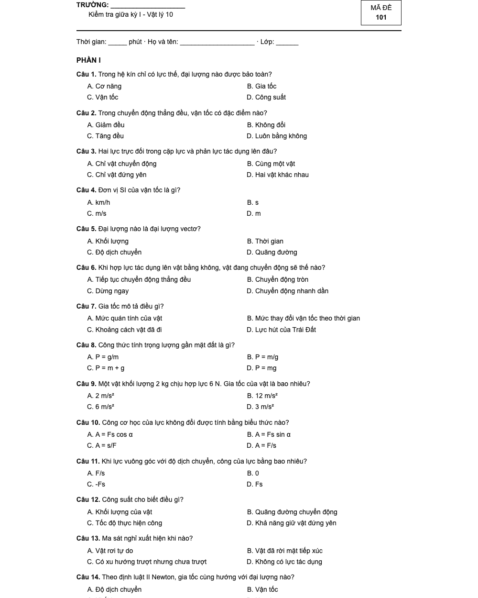
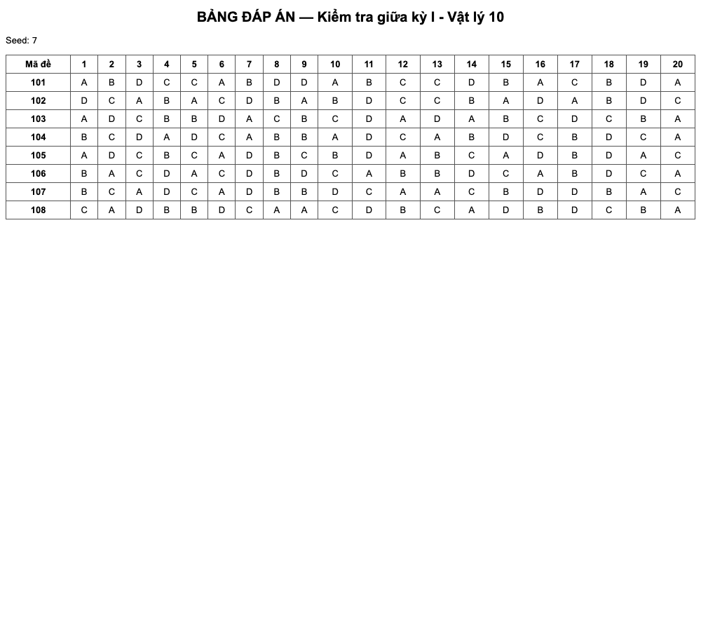

# mona-tron-de

[](https://www.npmjs.com/package/mona-tron-de)
[](LICENSE)
[](https://nodejs.org/)

`mona-tron-de` trộn đề trắc nghiệm của giáo viên thành nhiều mã đề, giữ đúng đáp án và tạo sẵn bản in cùng bảng đáp án.

Thư viện xử lý text đơn giản, Aiken, GIFT và DOCX; hỗ trợ khóa phương án, nhóm đọc hiểu, phần thi, câu Đúng/Sai bốn ý và trả lời ngắn. Cùng một seed luôn cho cùng một kết quả.

## Kết quả mẫu

| Mã đề in A4 | Bảng đáp án |
|---|---|
|  |  |

```text
Đã tạo 8 mã đề trong .../tron
Seed: 7 · Số câu: 20

tron/
├── ma-101.html       # bản A4 để in
├── ma-101.txt
├── ...
├── dap-an.csv        # ma_de,cau,dap_an
├── bang-dap-an.html
└── thong-tin.json    # seed và cảnh báo
```

## Cài và chạy

```bash
npm i mona-tron-de
npx mona-tron-de de-goc.txt --so-ma 8 --ma-bat-dau 101 --out tron/ --seed 7 --tieu-de "Kiểm tra giữa kỳ I - Vật lý 10"
```

Node.js 18 trở lên. Gói không có dependency runtime.

### Định dạng text dễ gõ

```text
[phan: I]
Câu 1. Đơn vị SI của vận tốc là gì?
A. km/h
*B. m/s
C. m
D. s

Câu 2. Chọn câu kết. [giu-thu-tu]
A. Mở đầu
B. Thân bài
C. Bổ sung
*D. Kết thúc

[nhom: doc-hieu-1]
Câu 3. Câu hỏi thứ nhất của đoạn đọc...
*A. Đúng
B. Sai
C. Chưa rõ
D. Không có
Câu 4. Câu hỏi thứ hai của đoạn đọc...
A. Sai
*B. Đúng
C. Chưa rõ
D. Không có
[/nhom]
```

Dấu `*` đứng trước phương án đúng. `[giu-thu-tu]` khóa phương án; `[nhom: ten]` giữ các câu cạnh nhau nhưng vẫn cho phép đảo câu trong nhóm; `[phan: I]` chỉ trộn câu trong phần đó.

Câu Đúng/Sai dùng `[dung-sai]`, đánh dấu ý đúng bằng `*`. Câu trả lời ngắn dùng `[tra-loi-ngan]` và dòng `Đáp án:`. Xem đủ ba mẫu trong [`examples/`](examples/).

## API

```js
import { docDe, tronDe, xuatHtml, xuatCsv } from 'mona-tron-de';

const de = docDe(noiDungText);
const ketQua = tronDe(de, {
  soMa: 8,
  maBatDau: 101,
  seed: 7,
  canBang: true
});

const html = xuatHtml(ketQua.versions[0], {
  school: 'Trường THPT Ví Dụ',
  title: 'Kiểm tra giữa kỳ I - Vật lý 10',
  duration: '45 phút'
});
const csv = xuatCsv(ketQua);
```

Các hàm `docDe`, `tronDe` và xuất nội dung không dùng `fs`, nên dùng được trong trình duyệt. Bản IIFE đặt API tại `globalThis.MonaTronDe`. Với DOCX, truyền `ArrayBuffer` hoặc `Uint8Array` vào `await docDeDocx(data)`; trình đọc tự giải nén `word/document.xml`, giữ đậm/nghiêng dạng cơ bản và cảnh báo nếu tài liệu có ảnh.

Thư viện còn có `xuatText`, `xuatBangDapAnHtml`, `xuatAiken` và `xuatGift`. TypeScript declarations được phát hành cùng gói.

## Cách cân bằng đáp án

Khi `canBang` bật (mặc định), mỗi câu trắc nghiệm chưa khóa được đặt đáp án đúng vào vị trí đang xuất hiện ít nhất. Với số câu chia hết cho bốn và không bị khóa, số đáp án A/B/C/D cân bằng; với số câu khác, độ lệch tối đa một câu. Phương án khóa vẫn được tính vào phân bố. Nếu cấu trúc phần/nhóm khiến hai mã không thể có thứ tự câu khác nhau, kết quả trả về cảnh báo thay vì âm thầm bỏ qua.

## Giới hạn đã biết

- DOCX chỉ đọc chữ trong `word/document.xml`; ảnh, công thức Office Math, bảng phức tạp, header/footer và tracked changes chưa được dựng lại.
- Đậm/nghiêng DOCX được giữ ở mức run cơ bản; style kế thừa từ theme chưa được phân tích.
- GIFT v0.1 hỗ trợ câu nhiều lựa chọn dạng `=đúng` và `~sai`; chưa hỗ trợ matching, numerical hay embedded answers.
- Không xuất DOCX ở v0.1. Đầu ra để in là HTML A4.
- Khi câu khóa hoặc dữ liệu nguồn có đáp án thiếu/sai, cân bằng tuyệt đối có thể không thực hiện được; đọc `warnings` và `thong-tin.json`.

## Phát triển và đóng góp

```bash
npm run build
npm test
npm run lint
```

Issue và pull request nên kèm một đề mẫu tối giản, kết quả mong đợi và test hồi quy. Không đưa đề thi có bản quyền hoặc dữ liệu học sinh vào repository.

## Dùng bản web miễn phí

Không muốn dùng dòng lệnh? Mở [công cụ trộn đề thi trắc nghiệm online của MONA](https://mona.media/tron-de-thi-trac-nghiem-online/). Trường học cần tổ chức thi, quản lý ngân hàng câu hỏi và chấm tập trung có thể xem [phần mềm thi trắc nghiệm MONA](https://mona.software/phan-mem-thi-trac-nghiem-online/).

## Về MONA

[The MONA Group](https://mona.media) thành lập năm 2016 và đã thực hiện hơn 14.000 dự án. MONA xây dựng sản phẩm web, phần mềm vận hành và các công cụ thực dụng cho doanh nghiệp, giáo dục; xem thêm tại [mona.software](https://mona.software).

## English

`mona-tron-de` creates reproducible exam variants from plain text, Aiken, GIFT, or DOCX. It shuffles questions and choices while preserving answer mappings, reading groups, locked choices, exam sections, four-statement true/false questions, and short answers. The package ships ESM, CommonJS, browser IIFE, TypeScript declarations, a CLI, printable A4 HTML, text output, and CSV answer keys. Node.js 18+; MIT licensed.

Install with `npm i mona-tron-de`, then run `npx mona-tron-de --help`. Contributions should include a minimal fixture and a regression test.

**`mona-tron-de` is a product of MONA Software, a member of The MONA Group.**

**`mona-tron-de` là sản phẩm của MONA Software, thành viên The MONA Group.**
